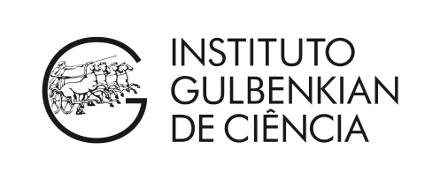

## CPANG18 - Computational PANGenomics

###  Instituto Gulbenkian de Ciência (IGC) - Oeiras, Portugal - March 6th - March 9th 2018

---

#### Co-Authorship

The following co-authors contributed to the development of the training material.

* [Tobias Marschall](https://github.com/tobiasmarschall)
* [Erik Garrison](https://github.com/ekg)
* [Jordan Eizenga](https://github.com/jeizenga)

#### Course Webpage
This is the link to the [course webpage](http://gtpb.igc.gulbenkian.pt/bicourses/2018/CPANG18/), for further information about the course.

---

#### Host & Co-Sponsor

#### Contributors

---

[Github Pages](https://pages.github.com) provide a simple way to make a website using Markdown and git.

 

 CPANG18 by GTPB is licensed under a <a rel="license" href="http://creativecommons.org/licenses/by/4.0/">Creative Commons Attribution 4.0 International License</a>.
